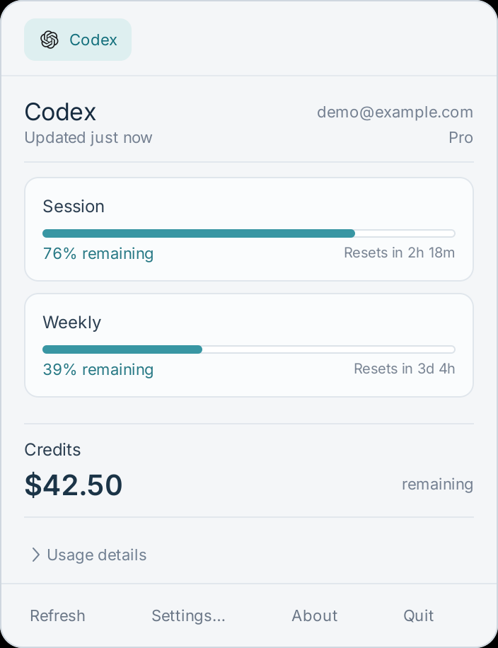

# CodexBar Linux

**A native GTK3 desktop-tray frontend based on [steipete/CodexBar](https://github.com/steipete/CodexBar), adapted for Linux.** The initial GTK frontend and usage adapter derive from [Marouan-chak/codexbar-waybar](https://github.com/Marouan-chak/codexbar-waybar). This community port is not an official upstream Linux GUI release.

[中文说明](#中文说明) · [Download releases](https://github.com/AidenLyu/CodexBar-Linux/releases) · [Validation](VALIDATION.md)



## Features

- A resident desktop tray with an instantly available, native GTK3/GDK popup.
- **Colored bars mean remaining quota; white means consumed quota.** Unknown quotas have no bar.
- Provider tabs, account identity, reset times, credits and expandable usage details.
- Background refresh every minute, with visible stale-cache state on failures.
- Provider selection, private atomic settings writes, local/UTC reset formatting.
- High-DPI icons, constrained scrolling, Escape/outside-click dismissal and explicit Quit.
- Login autostart; no Electron, browser window or Conda environment required.

## Install

Validated on **Ubuntu 22.04, GNOME 42, X11/Xorg, amd64**, with the GNOME AppIndicator tray extension. This version deliberately does not support a native Wayland session. Other X11 desktops may work but are not validated.

Download `codexbar-linux_1.0.0_amd64.deb` and `SHA256SUMS` from Releases:

```sh
sha256sum -c SHA256SUMS
sudo apt install ./codexbar-linux_1.0.0_amd64.deb
codexbar-linux
```

The package includes the checksum-verified **CodexBar CLI 0.58.0 static Linux build**, GTK frontend, provider icons and OFL-licensed Inter font. Dependencies are installed by apt. No credentials are bundled. Authenticate the provider you use (for example, `codex login`), then enable it in Settings. Installing this app does not create a provider subscription or sign you in.

Open it from the application menu or click the stacked-bar tray icon. Use `codexbar-linux --popup` to open the popup and `codexbar-linux --quit` to quit. It starts again at the next graphical login. To disable login startup, copy `/etc/xdg/autostart/codexbar-linux.desktop` into `~/.config/autostart/` and add `Hidden=true`.

An optional user service is included:

```sh
systemctl --user enable --now codexbar-linux.service
journalctl --user -u codexbar-linux.service
```

The application is single-instance; invoking its launcher again does not create a second tray. If replacing an earlier manual installation, stop its tray first and remove/disable its old autostart entry.

## Data and configuration

Existing `~/.codexbar/config.json` is honored. New installations use `${XDG_CONFIG_HOME:-~/.config}/codexbar/config.json`; `CODEXBAR_CONFIG` overrides this path. Settings preserve credentials and unknown configuration fields. GUI preferences and cache use the existing `codexbar-waybar` subdirectory for migration compatibility. Disabling every provider really disables fetching.

Provider availability and authentication depend on the upstream CLI. Codex is the only provider live-tested for this release. Other providers' generic selection, rendering, errors and caching are fixture-tested; platform-dependent browser/cookie integrations are not guaranteed. About opens this repository in your browser.

## Build and verify

```sh
sudo apt install python3 python3-gi python3-gi-cairo python3-cairo gir1.2-gtk-3.0 \
  librsvg2-common jq gcc dpkg-dev xz-utils xvfb xauth dbus-x11 shellcheck openbox x11-utils
cd linux
/usr/bin/python3 -m unittest discover -s tests -v
bash tests/run_native.sh
/usr/bin/python3 packaging/build_deb.py
```

The first build downloads one upstream CLI archive with a pinned SHA-256; subsequent builds use `.cache/`. The `.deb` and checksums appear in `dist/`. Package files are installed under `/usr/lib/codexbar-linux` and `/usr/share`; user data is never included in the build. The old Waybar installation guide remains in `README.waybar-upstream.md` for provenance and is not the native GUI installation procedure.

## Attribution and license

- **steipete/CodexBar**, MIT: original product, provider CLI, icons and macOS design reference. Original source remains at the repository root.
- **Marouan-chak/codexbar-waybar**, MIT, copyright Marouan Chakran: starting frontend, provider rendering helpers and shell adapter; its license is retained in `linux/LICENSE`.
- **Aiden Lyu**: native GNOME/X11 adaptation, UI corrections, packaging and release validation.
- **Inter**, SIL Open Font License: `assets/fonts/OFL.txt`.

The Linux GUI is implemented using GTK and is not a pixel-identical AppKit/SwiftUI clone. No affiliation or endorsement by the upstream authors is implied.

## 中文说明

这是基于 **steipete/CodexBar** 开发的 Linux 原生状态栏版本，界面代码也基于 **Marouan-chak/codexbar-waybar**，保留两个项目的署名和许可证。

当前验证环境：Ubuntu 22.04 / GNOME / X11 / amd64。下载 Release 中的 `.deb` 后使用 `sudo apt install ./codexbar-linux_1.0.0_amd64.deb` 安装。需要先登录自己的服务商账号，再在 Settings 中启用提供商。

彩色进度条代表剩余用量，白色代表已用用量。点击状态栏图标查看，Esc 或点击外部收起，后台继续运行；Usage details 可展开。安装包自带固定版本的官方 CLI，不包含开发者的账号、缓存或密钥。Wayland 和其他提供商的真实登录流程尚未完成验证，详见功能检查报告。
